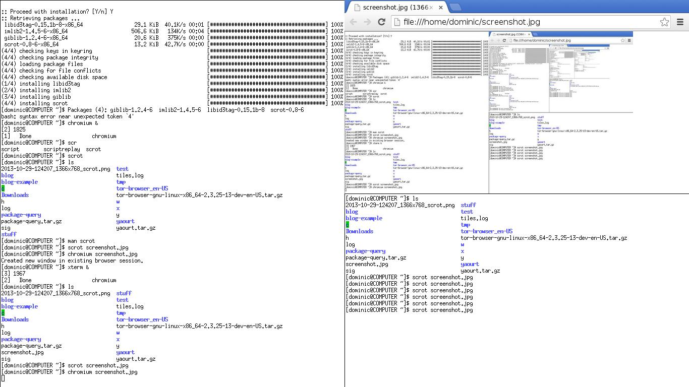

# tiles

A pure js xorg window manager, that I wrote on the plane.



## Usage - development

install `Xephyr` to run another display inside your current window manager.

then start everything with the `DISPLAY` envar set,
so it will run in the correct display.

```
Xephyr -br :1 &
DISPLAY=:1 xterm &
DISPLAY=:1 node tiles.js
```

## Usage - production

first, install globally `npm install -g tiles`

my `~/.xinit` looks like this:

```
setxkbmap -layout dvorak
export TERM='xterm -fn=7x13 -rv'
exec node /home/dominic/c/tiles/tiles.js > tiles.log
```

On my setup, I login on a bare terminal, and then start my window manager with `startx`.
If you use `ubuntu` or something with a shishi login screen you can add the following to
`/usr/share/xsessions`

```
[Desktop Entry]
Encoding=UTF-8
Name=tiles
Comment=This session starts tiles
Exec=/PATH/TO/tiles.js
Type=Application
```
(that is what [nwm](https://github.com/mixu/nwm) suggests, so that will probably work)

## Acknowledgements

This was easy becase of [x11](http://ghub.io/x11),
and what I had learnt hacking on [nwm](https://github.com/mixu/nwm)
I would also never have done this if [gb](http://gwenbell.com) and [eb](http://evbogue.com/)
hadn't helped me install archlinux (and escape OSX)

## TODO

* focus window on mouseover (currently chrome breaks this)
* multiple workspaces
* keyboard shortcuts
* refactor out `xorg.js` once I get more familiar with it.

## License

MIT
